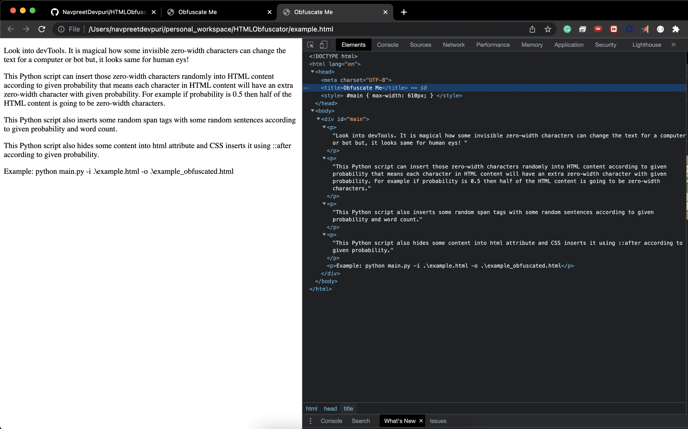
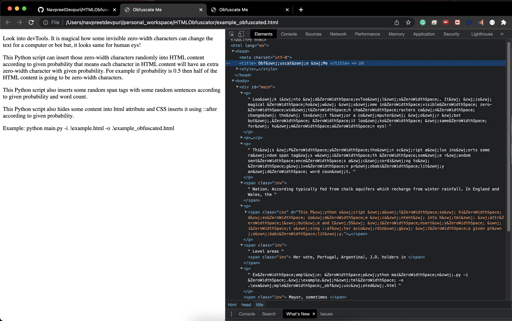

# HTMLObfuscator

HTML Obfuscator using beautifulsoup in python

Open obfuscated HTML and look into devTools. It is magical how some invisible zero-width characters can change the text for a computer or bot but, it looks same for human eys!

This Python script can insert those zero-width characters randomly into HTML content according to given probability that means each character in HTML content will have an extra zero-width character with given probability. For example if probability is 0.5 then half of the HTML content is going to be zero-width characters.

This Python script also inserts some random span tags with some random sentences according to given probability and word count.

This Python script also hides some content into html attribute and CSS inserts it using ::after according to given probability.

Example: `python main.py -i .\example.html -o .\example_obfuscated.html`

## Screenshots

### example.html

### example_obfuscated.html
